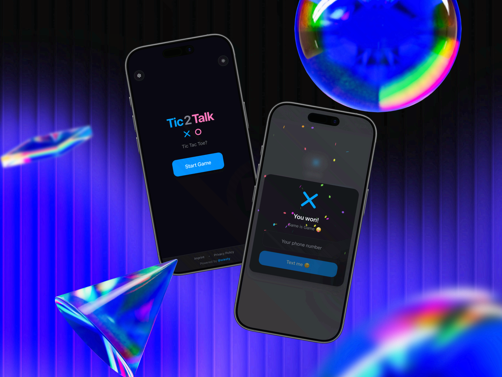

# Tic2Talk 🎮

A modern, playful icebreaker game built with Astro and React. Tic2Talk puts a unique twist on the classic Tic Tac Toe - each player can only have 3 pieces on the board at a time, with the oldest piece being automatically removed when placing a fourth. Perfect as a fun conversation starter between two people!



## ✨ Features

### 🎯 Core Game Mechanics
- **Unique 3-Piece Rule**: Each player can only have 3 pieces on the board - oldest piece gets removed automatically
- **Visual Indicators**: Pulsing animation shows which piece will be removed next
- **Smooth Animations**: Confetti celebration on wins, smooth piece placement and removal
- **Win Sound Effect**: Embedded audio plays on victory

### 🎨 Modern UI/UX
- **Dark/Light Mode**: System-aware theme with manual toggle
- **Fully Responsive**: Optimized for mobile and desktop
- **Beautiful Animations**: Fade-in effects, zoom animations, and smooth transitions
- **Custom Icons**: Animated X and O icons with SVG stroke animations

### ⚙️ Customizable Settings
- **Rigged Mode**: X can never win - only O (Pink) wins (perfect for pranks!)
- **Phone Number Collection**: Optionally ask winner for their phone number
- **Name Input**: Optionally collect winner's name
- **No Skip Button**: Force phone number entry (no escape route 😄)
- **Settings Persistence**: All preferences saved in localStorage

### 📱 PWA Features
- **Installable**: Full Progressive Web App support for iOS and Android
- **Offline Mode**: Works completely offline after first visit
- **Add to Home Screen**: Native install prompts for mobile devices
- **Network-First Strategy**: Always tries to load fresh content when online
- **Service Worker**: Smart caching with automatic update detection

### 🎁 Contact Features
- **vCard Generation**: Creates proper contact cards from collected phone numbers
- **iOS Optimized**: Direct contact card display on iPhone
- **Android Share API**: Native sharing on Android devices
- **Desktop Download**: Falls back to vCard download on desktop

### 🛡️ Privacy & Data
- **Local Storage Only**: All game data stored locally on device
- **Session-Based**: Phone numbers only saved for current session
- **No External Tracking**: No analytics or third-party services
- **GDPR Compliant**: Full privacy policy included

## 🚀 Tech Stack

- **Framework**: [Astro](https://astro.build/) - Static site generation
- **UI Library**: [React 19](https://react.dev/) - Interactive components
- **Styling**: [Tailwind CSS 4](https://tailwindcss.com/) - Utility-first CSS
- **UI Components**: [Radix UI](https://www.radix-ui.com/) - Accessible primitives
- **Icons**: [Lucide React](https://lucide.dev/) - Beautiful icon library
- **Animations**: [canvas-confetti](https://github.com/catdad/canvas-confetti) - Celebration effects
- **Type Safety**: TypeScript - Full type checking

## 📦 Installation

```bash
# Clone the repository
git clone https://github.com/yourusername/tic2talk.git
cd tic2talk/astro-build

# Install dependencies
npm install

# Start development server
npm run dev

# Build for production
npm run build

# Preview production build
npm run preview
```

## 🏗️ Project Structure

```
astro-build/
├── public/
│   ├── img/              # All icons and images
│   ├── manifest.json     # PWA manifest
│   ├── sw.js            # Service Worker
│   ├── browserconfig.xml # Windows tile config
│   ├── robots.txt       # SEO robots file
│   └── sitemap.xml      # Sitemap for SEO
├── src/
│   ├── components/
│   │   ├── ui/          # Base UI components (Button, Input, etc.)
│   │   ├── Game.tsx     # Main game component
│   │   ├── game-board.tsx
│   │   ├── game-icons.tsx
│   │   ├── turn-indicator.tsx
│   │   ├── winner-modal.tsx
│   │   ├── settings-modal.tsx
│   │   ├── confirm-exit-modal.tsx
│   │   ├── theme-toggle.tsx
│   │   ├── install-prompt.tsx
│   │   └── footer.tsx
│   ├── hooks/
│   │   └── use-tic-tac-toe.ts  # Game logic hook
│   ├── lib/
│   │   └── utils.ts     # Utility functions
│   ├── pages/
│   │   ├── index.astro  # Landing page
│   │   └── datenschutz.astro  # Privacy policy
│   └── styles/
│       └── globals.css  # Global styles and animations
├── astro.config.mjs     # Astro configuration
├── tsconfig.json        # TypeScript config
└── package.json         # Dependencies
```

## 🎮 How to Play

1. **Start Game**: Click "Start Game" on the landing page
2. **Take Turns**: Players alternate placing X and O on the 3x3 grid
3. **3-Piece Limit**: When you place your 4th piece, your oldest piece is automatically removed
4. **Win**: Get 3 in a row (horizontal, vertical, or diagonal)
5. **Collect Contact**: Winner can optionally share their phone number

## 🔧 Configuration

### Settings (Configurable in-game)
- **Rigged Mode**: Make X unable to win (great for pranks!)
- **Phone Collection**: Enable/disable phone number collection after win
- **Require Phone**: Make phone number mandatory (no skip button)
- **Ask for Name**: Also collect winner's name along with phone

### Service Worker Cache Strategy
The app uses a **Network-First** strategy:
- Always tries to fetch fresh content when online
- Falls back to cache when offline
- Automatic cache updates when new version deployed

To update cache version, modify `CACHE_NAME` in [public/sw.js](public/sw.js):
```javascript
const CACHE_NAME = 'tic2talk-v3'; // Increment version number
```

## 📱 PWA Installation

### iOS (Safari)
1. Open website in Safari
2. Tap Share button
3. Scroll down and tap "Add to Home Screen"
4. Tap "Add"

### Android (Chrome)
1. Open website in Chrome
2. Tap browser menu (3 dots)
3. Tap "Install app" or "Add to Home Screen"
4. Confirm installation

## 🌐 Deployment

The app is a static site and can be deployed to any static hosting service:


## 🔒 Privacy & Security

- All game data stored locally in browser
- Phone numbers stored in session memory only (cleared on page refresh)
- No external API calls or tracking
- No cookies used
- SSL/TLS encryption recommended for production

## 🎨 Customization

### Colors
Modify color scheme in [src/styles/globals.css](src/styles/globals.css):
```css
:root {
  --primary: oklch(0.6 0.2 250);  /* Blue for X */
  --secondary: oklch(0.75 0.15 350); /* Pink for O */
}
```

### Animations
All animations defined in [src/styles/globals.css](src/styles/globals.css):
- `drawLine` - X icon drawing animation
- `drawCircle` - O icon drawing animation
- `pulseOldest` - Oldest piece indicator
- `confetti` - Win celebration


## 🙏 Acknowledgments

- Built with [Astro](https://astro.build/)
- UI components from [Radix UI](https://www.radix-ui.com/)
- Icons by [Lucide](https://lucide.dev/)
- Confetti by [canvas-confetti](https://github.com/catdad/canvas-confetti)

---

**Live Demo**: [t2t.app](https://t2t.app)

Made with ❤️ for breaking the ice
